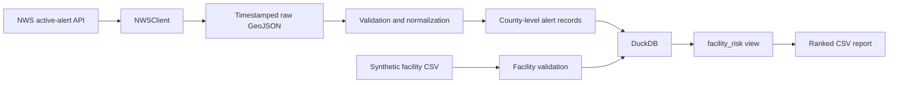

# Decision Readiness Platform

An end-to-end data engineering project that combines live National Weather Service alerts with synthetic emergency-logistics data to identify North Carolina facilities facing simultaneous weather and supply risk.

## What it demonstrates

- API ingestion with explicit timeouts, headers, and HTTP error handling
- Immutable, timestamped raw JSON storage
- Validation and normalization into county-level alert records
- Geographic joins using SAME county codes normalized to five-digit FIPS codes
- Curated analytical storage and SQL modeling in DuckDB
- A reproducible facility-risk report built from synthetic inventory assumptions
- Mocked client tests, filesystem tests, transformation tests, and an end-to-end test
- Automated linting, formatting, and tests through GitHub Actions

## Decision question

Which facilities are most exposed when insufficient supply coverage and active severe-weather conditions occur together?

## Architecture



The pipeline keeps retrieval, source preservation, validation, transformation, and decision modeling separate so each boundary can be tested independently.

## Quick start

Requires Python 3.11 or newer.

```bash
python3 -m venv .venv
source .venv/bin/activate
python -m pip install -e ".[dev]"
cp .env.example .env
```

Edit `.env` and replace the example NWS contact address. Then load the configuration:

```bash
set -a
source .env
set +a
```

Retrieve current North Carolina alerts:

```bash
ingest-nws-alerts
```

Build the curated database and risk report from the latest raw response:

```bash
build-decision-readiness
```

Outputs are written locally and ignored by Git:

```text
data/raw/nws_alerts/alerts_<UTC timestamp>.json
data/curated/decision_readiness.duckdb
data/curated/facility_risk.csv
```

You can also reproduce a historical run by selecting a specific raw file:

```bash
build-decision-readiness \
  --raw-alerts data/raw/nws_alerts/alerts_20260808T185418Z.json
```

## Example result

The included synthetic facilities and a historical NWS response produce output shaped like this:

| Facility | Days of supply | Active alerts | Highest severity | Supply status | Risk score | Band |
|---|---:|---:|---|---|---:|---|
| Wilmington Coastal Depot | 2.40 | 1 | Moderate | CRITICAL | 44.0 | MEDIUM |
| Henderson Distribution Point | 3.00 | 1 | Moderate | CRITICAL | 35.0 | MEDIUM |
| Morganton Support Center | 6.67 | 1 | Moderate | STABLE | 20.0 | LOW |
| Raleigh Regional Hub | 3.60 | 0 | None | CRITICAL | 16.8 | LOW |
| Charlotte Logistics Hub | 6.67 | 0 | None | STABLE | 0.0 | LOW |

These results demonstrate pipeline behavior; they are not operational recommendations.

## Data model

### Alert–county record

One NWS alert can affect multiple counties. The transformation therefore creates one record per `alert_id` and `county_fips`, preserving event, severity, certainty, urgency, effective/expiration times, retrieval time, and source URL.

### Facility record

Facilities are fictional and contain a five-digit county FIPS code, resource type, on-hand units, daily demand, and safety-stock target. The included sample focuses on water cases.

### Risk model

The demonstration score combines:

- Up to 60 points for supply falling below the facility’s safety-stock target
- Up to 40 points for NWS severity (`Unknown` through `Extreme`)

Bands are `LOW` below 30, `MEDIUM` from 30 to below 60, and `HIGH` at 60 or above. This transparent heuristic is intentionally simple; it is not a validated emergency-management model.

## Quality checks

```bash
ruff check .
ruff format --check .
python -m pytest -v
```

The test suite covers:

- Correct NWS request method, endpoint, parameters, and headers
- Explicit failure on unsuccessful HTTP responses
- Deterministic timestamped raw paths
- Atomic raw JSON writes using a temporary file
- NWS field validation and SAME-to-FIPS normalization
- End-to-end DuckDB creation and facility-risk output

## Repository map

```text
src/decision_readiness/
├── clients/       # external API boundaries
├── models/        # validated domain records
├── pipelines/     # ingestion and MVP orchestration
├── storage/       # DuckDB persistence and risk view
└── transforms/    # source-to-domain normalization

data/
├── raw/           # immutable runtime responses; ignored
├── curated/       # generated database/reports; ignored
└── sample/        # versioned synthetic facility inputs

tests/             # unit, transformation, filesystem, and end-to-end tests
docs/              # architecture, data card, and detailed repository guide
```

## Limitations and next improvements

- The risk score is illustrative and needs stakeholder validation before real use.
- Synthetic inventory is static and does not yet model shipments or consumption over time.
- SAME county codes provide a practical join but do not capture alert geometry within a county.
- The current pipeline rebuilds a local snapshot rather than maintaining history incrementally.
- A later version could add Census population exposure, orchestration, observability, an API, and a TypeScript dashboard.

## Information safety

This independent portfolio project uses public or synthetic data. It contains no government, customer, proprietary, classified, controlled, or operational information. No code, schemas, prompts, configuration, screenshots, or interface designs are reproduced from Palantir Foundry or another government or customer system.

## License

Project code is released under the MIT License. Public data and third-party dependencies retain their original terms.
